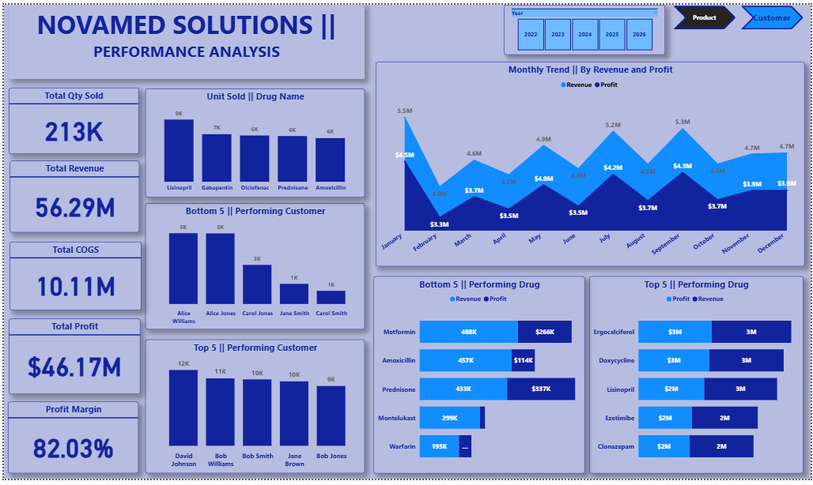
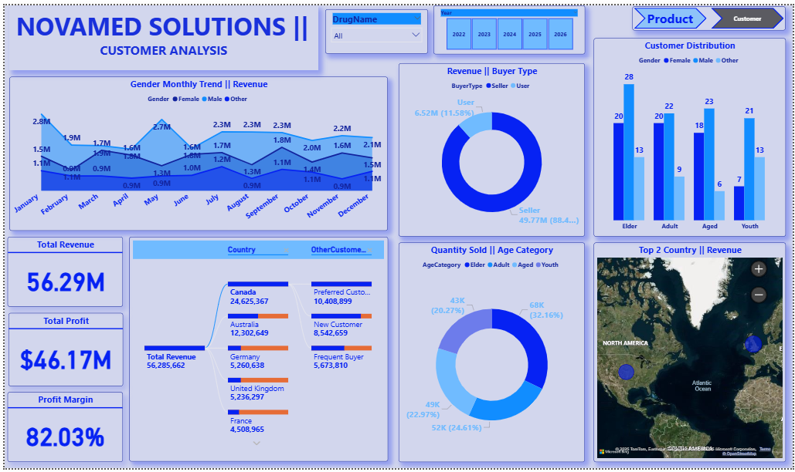
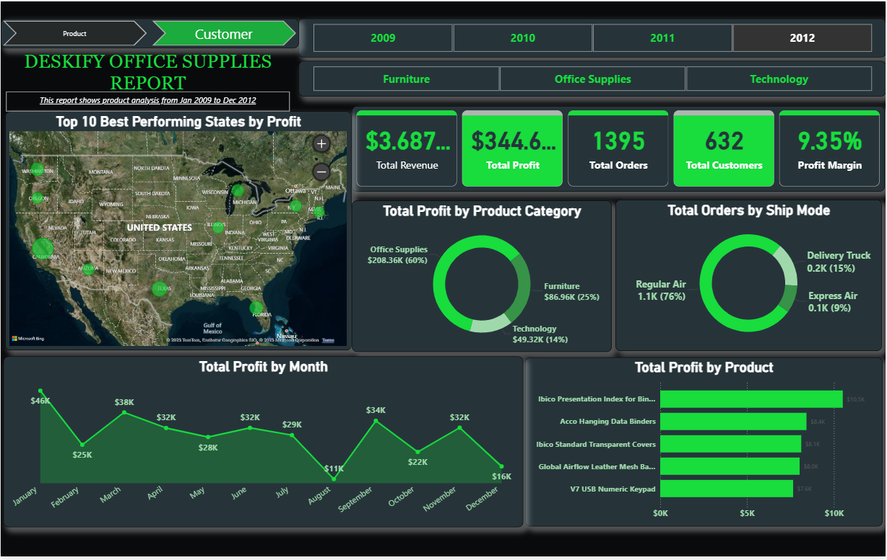
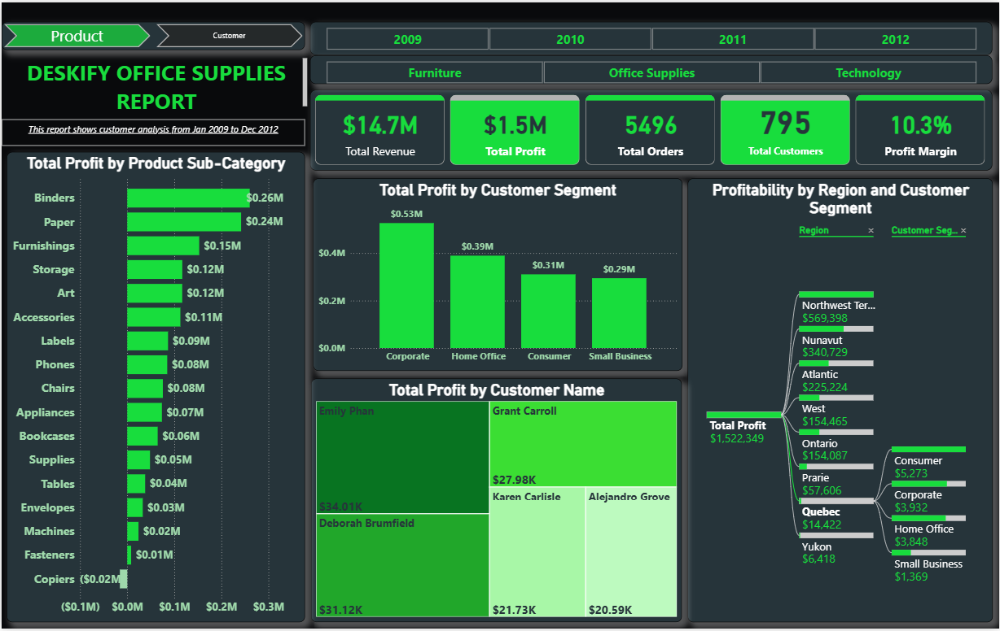

##  👋 Welcome to My GitHub Profile

# 🧩 About Me  
Hello! I am **Aletor**, a **Math Educator turned Data Analyst** who loves transforming raw data into meaningful insights.  
My journey from the classroom to analytics has strengthened my skills in **pattern recognition**, **problem-solving**, and **storytelling with data**.  

I hold a **Master Data Analyst certification** and completed a **Data Analyst Internship Program**, earning a *Certificate of Excellence* for analytical performance and tool proficiency.  
I now apply my expertise in **Excel, Power BI, SQL, and Python** to build dashboards, analyze trends, and communicate insights that help organizations make better decisions.  

---

## 💼 Professional Skills  

### 🔹 Data Analytics  
- **Excel** 📊: Advanced in data cleaning, PivotTables, Power Query, VLOOKUP, and complex formulas. Capable of creating dynamic dashboards for reporting and visualization.
  
- **Power BI** 📈: Skilled in building interactive dashboards and compelling visual narratives that communicate insights effectively.
   
- **SQL** 🛠️: Proficient in writing queries to extract, manipulate, and analyze data from relational databases. Experienced in optimizing queries for performance on large datasets.
   
- **Python** 🐍: Experienced in using Python for data analysis, statistical modeling, and automation. Proficient with libraries such as *Pandas, NumPy, Matplotlib, Seaborn, Scikit-learn,* and *TensorFlow*.
   
- **Data Visualization** 🌟: Adept at creating clear and engaging visuals using tools like *Power BI, Tableau, Matplotlib,* and *Seaborn* to simplify complex insights.  

---

# 🎓 Certifications  
- 🏅 **Certificate of Excellence** – Data Analytics Internship Programme – *UPTRAIL* (Nov. 2025)  
- 🎖️ **Certificate of Completion** – Data Analytics Internship Programme – *UPTRAIL* (Nov. 2025)  
- 🎓 **Master Data Analytics** – *10Alytics* (Sept. 2025)  

---

# 📬 Contact Me  
---

## 🔍 My Projects

A glimpse of some of the projects I’ve been working on.

### 📌 Project Overview

#### 1. NovaMed Sales & Customer Dashboard  
This Power BI dashboard analyses NovaMed’s pharmaceutical sales and customer performance across multiple segments, including demographics, geography, and revenue contribution. The dashboard helps identify the most profitable drugs, top customers, and promising market segments, and provides actionable insights for strategic planning and portfolio optimization.

*NovaMed Power BI dashboard, snapshot.*  

**Key highlights**
- Identifies top revenue-contributing products and customer cohorts.  
- Compares performance by region and demographic segments.  
- Includes filters for time, product family, and customer type to support decision making.

---

#### 2. Deskify Office Supplies Dashboard  
The Deskify Power BI project analyses office supply sales between 2009 and 2012, covering product, customer, and regional performance. The dashboard provides insights into profit distribution, customer segments, and delivery modes, supporting inventory management and targeted customer outreach.

*Deskify Product Report.pdf.*  

**Key highlights**
- Visualizes profit and revenue trends by product and region.  
- Segments customers by purchase behavior and profitability.  
- Reveals delivery mode impact on cost and customer satisfaction.

---

## 📬 Contact Me

I am always open to discussing new projects, collaborations, or opportunities in data analytics and data science. Feel free to reach out to me via LinkedIn or email.  

Thank you for visiting my profile! I look forward to connecting with fellow data enthusiasts and professionals. 🌟

---
I am always open to discussing **new projects, collaborations, or opportunities** in data analytics and data science.  
Feel free to reach out to me via **[LinkedIn](https://www.linkedin.com)** or **email**.  

Thank you for visiting my profile!  
I look forward to connecting with fellow data enthusiasts and professionals. 🌟
